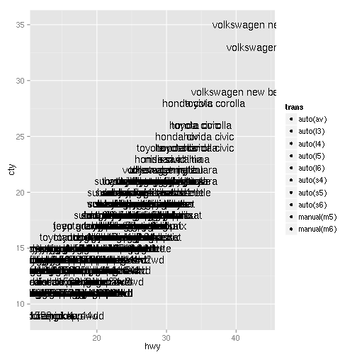

# Install 

```r
library("devtools")
install_github("geomtaco", "csv")
```

Windows users also must first install
[Rtools](http://cran.rstudio.com/bin/windows/Rtools/).
 
# Example


```r
library(geomtaco)
ggplot(mpg) + aes(label = paste(manufacturer, model), fill = trans, cilantro = TRUE, 
    x = hwy, y = cty) + geom_text() + geom_taco()
```

 

```
## The following objects are masked from data (position 3):
## 
##     cilantro, fill, group, guacamole, label, lime, PANEL, radish,
##     salsa, x, y
## The following objects are masked from data (position 5):
## 
##     cilantro, fill, group, guacamole, label, lime, PANEL, radish,
##     salsa, x, y
## 
## One taco for "audi a4" with:
## * pescado
## * medium salsa
## * no lime
## * no radish
## * no guacamole
## * cilantro
##  
## One taco for "audi a4" with:
## * molida
## * medium salsa
## * no lime
## * no radish
## * no guacamole
## * cilantro
##  
## One taco for "audi a4" with:
## * pollo
## * medium salsa
## * no lime
## * no radish
## * no guacamole
## * cilantro
##  
## One taco for "audi a4" with:
## * chileverde
## * medium salsa
## * no lime
## * no radish
## * no guacamole
## * cilantro
##  
## One taco for "audi a4" with:
## * pescado
## * medium salsa
## * no lime
## * no radish
## * no guacamole
## * cilantro
##  
## One taco for "audi a4" with:
## * molida
## * medium salsa
## * no lime
## * no radish
## * no guacamole
## * cilantro
##  
## One taco for "audi a4" with:
## * chileverde
## * medium salsa
## * no lime
## * no radish
## * no guacamole
## * cilantro
##  
## One taco for "audi a4 quattro" with:
## * molida
## * medium salsa
## * no lime
## * no radish
## * no guacamole
## * cilantro
##  
## One taco for "audi a4 quattro" with:
## * pescado
## * medium salsa
## * no lime
## * no radish
## * no guacamole
## * cilantro
##  
## One taco for "audi a4 quattro" with:
## * pollo
## * medium salsa
## * no lime
## * no radish
## * no guacamole
## * cilantro
##  
## One taco for "audi a4 quattro" with:
## * chorizo
## * medium salsa
## * no lime
## * no radish
## * no guacamole
## * cilantro
##  
## One taco for "audi a4 quattro" with:
## * pescado
## * medium salsa
## * no lime
## * no radish
## * no guacamole
## * cilantro
##  
## One taco for "audi a4 quattro" with:
## * molida
## * medium salsa
## * no lime
## * no radish
## * no guacamole
## * cilantro
##  
## One taco for "audi a4 quattro" with:
## * chorizo
## * medium salsa
## * no lime
## * no radish
## * no guacamole
## * cilantro
##  
## One taco for "audi a4 quattro" with:
## * pollo
## * medium salsa
## * no lime
## * no radish
## * no guacamole
## * cilantro
##  
## One taco for "audi a6 quattro" with:
## * pescado
## * medium salsa
## * no lime
## * no radish
## * no guacamole
## * cilantro
##  
## One taco for "audi a6 quattro" with:
## * chorizo
## * medium salsa
## * no lime
## * no radish
## * no guacamole
## * cilantro
##  
## One taco for "audi a6 quattro" with:
## * chorizo
## * medium salsa
## * no lime
## * no radish
## * no guacamole
## * cilantro
##  
## One taco for "chevrolet c1500 suburban 2wd" with:
## * cabeza
## * medium salsa
## * no lime
## * no radish
## * no guacamole
## * cilantro
##  
## One taco for "chevrolet c1500 suburban 2wd" with:
## * cabeza
## * medium salsa
## * no lime
## * no radish
## * no guacamole
## * cilantro
##  
## One taco for "chevrolet c1500 suburban 2wd" with:
## * cabeza
## * medium salsa
## * no lime
## * no radish
## * no guacamole
## * cilantro
##  
## One taco for "chevrolet c1500 suburban 2wd" with:
## * cabeza
## * medium salsa
## * no lime
## * no radish
## * no guacamole
## * cilantro
##  
## One taco for "chevrolet c1500 suburban 2wd" with:
## * cabeza
## * medium salsa
## * no lime
## * no radish
## * no guacamole
## * cilantro
##  
## One taco for "chevrolet corvette" with:
## * pollo
## * medium salsa
## * no lime
## * no radish
## * no guacamole
## * cilantro
##  
## One taco for "chevrolet corvette" with:
## * cabeza
## * medium salsa
## * no lime
## * no radish
## * no guacamole
## * cilantro
##  
## One taco for "chevrolet corvette" with:
## * pollo
## * medium salsa
## * no lime
## * no radish
## * no guacamole
## * cilantro
##  
## One taco for "chevrolet corvette" with:
## * chorizo
## * medium salsa
## * no lime
## * no radish
## * no guacamole
## * cilantro
##  
## One taco for "chevrolet corvette" with:
## * pollo
## * medium salsa
## * no lime
## * no radish
## * no guacamole
## * cilantro
##  
## One taco for "chevrolet k1500 tahoe 4wd" with:
## * cabeza
## * medium salsa
## * no lime
## * no radish
## * no guacamole
## * cilantro
##  
## One taco for "chevrolet k1500 tahoe 4wd" with:
## * cabeza
## * medium salsa
## * no lime
## * no radish
## * no guacamole
## * cilantro
##  
## One taco for "chevrolet k1500 tahoe 4wd" with:
## * cabeza
## * medium salsa
## * no lime
## * no radish
## * no guacamole
## * cilantro
##  
## One taco for "chevrolet k1500 tahoe 4wd" with:
## * cabeza
## * medium salsa
## * no lime
## * no radish
## * no guacamole
## * cilantro
##  
## One taco for "chevrolet malibu" with:
## * cabeza
## * medium salsa
## * no lime
## * no radish
## * no guacamole
## * cilantro
##  
## One taco for "chevrolet malibu" with:
## * cabeza
## * medium salsa
## * no lime
## * no radish
## * no guacamole
## * cilantro
##  
## One taco for "chevrolet malibu" with:
## * cabeza
## * medium salsa
## * no lime
## * no radish
## * no guacamole
## * cilantro
##  
## One taco for "chevrolet malibu" with:
## * cabeza
## * medium salsa
## * no lime
## * no radish
## * no guacamole
## * cilantro
##  
## One taco for "chevrolet malibu" with:
## * chorizo
## * medium salsa
## * no lime
## * no radish
## * no guacamole
## * cilantro
##  
## One taco for "dodge caravan 2wd" with:
## * lengua
## * medium salsa
## * no lime
## * no radish
## * no guacamole
## * cilantro
##  
## One taco for "dodge caravan 2wd" with:
## * cabeza
## * medium salsa
## * no lime
## * no radish
## * no guacamole
## * cilantro
##  
## One taco for "dodge caravan 2wd" with:
## * cabeza
## * medium salsa
## * no lime
## * no radish
## * no guacamole
## * cilantro
##  
## One taco for "dodge caravan 2wd" with:
## * cabeza
## * medium salsa
## * no lime
## * no radish
## * no guacamole
## * cilantro
##  
## One taco for "dodge caravan 2wd" with:
## * cabeza
## * medium salsa
## * no lime
## * no radish
## * no guacamole
## * cilantro
##  
## One taco for "dodge caravan 2wd" with:
## * cabeza
## * medium salsa
## * no lime
## * no radish
## * no guacamole
## * cilantro
##  
## One taco for "dodge caravan 2wd" with:
## * cabeza
## * medium salsa
## * no lime
## * no radish
## * no guacamole
## * cilantro
##  
## One taco for "dodge caravan 2wd" with:
## * cabeza
## * medium salsa
## * no lime
## * no radish
## * no guacamole
## * cilantro
##  
## One taco for "dodge caravan 2wd" with:
## * cabeza
## * medium salsa
## * no lime
## * no radish
## * no guacamole
## * cilantro
##  
## One taco for "dodge caravan 2wd" with:
## * pastor
## * medium salsa
## * no lime
## * no radish
## * no guacamole
## * cilantro
##  
## One taco for "dodge caravan 2wd" with:
## * pastor
## * medium salsa
## * no lime
## * no radish
## * no guacamole
## * cilantro
##  
## One taco for "dodge dakota pickup 4wd" with:
## * pollo
## * medium salsa
## * no lime
## * no radish
## * no guacamole
## * cilantro
##  
## One taco for "dodge dakota pickup 4wd" with:
## * cabeza
## * medium salsa
## * no lime
## * no radish
## * no guacamole
## * cilantro
##  
## One taco for "dodge dakota pickup 4wd" with:
## * cabeza
## * medium salsa
## * no lime
## * no radish
## * no guacamole
## * cilantro
##  
## One taco for "dodge dakota pickup 4wd" with:
## * molida
## * medium salsa
## * no lime
## * no radish
## * no guacamole
## * cilantro
##  
## One taco for "dodge dakota pickup 4wd" with:
## * pescado
## * medium salsa
## * no lime
## * no radish
## * no guacamole
## * cilantro
##  
## One taco for "dodge dakota pickup 4wd" with:
## * pescado
## * medium salsa
## * no lime
## * no radish
## * no guacamole
## * cilantro
##  
## One taco for "dodge dakota pickup 4wd" with:
## * pescado
## * medium salsa
## * no lime
## * no radish
## * no guacamole
## * cilantro
##  
## One taco for "dodge dakota pickup 4wd" with:
## * molida
## * medium salsa
## * no lime
## * no radish
## * no guacamole
## * cilantro
##  
## One taco for "dodge dakota pickup 4wd" with:
## * cabeza
## * medium salsa
## * no lime
## * no radish
## * no guacamole
## * cilantro
##  
## One taco for "dodge durango 4wd" with:
## * cabeza
## * medium salsa
## * no lime
## * no radish
## * no guacamole
## * cilantro
##  
## One taco for "dodge durango 4wd" with:
## * pescado
## * medium salsa
## * no lime
## * no radish
## * no guacamole
## * cilantro
##  
## One taco for "dodge durango 4wd" with:
## * pescado
## * medium salsa
## * no lime
## * no radish
## * no guacamole
## * cilantro
##  
## One taco for "dodge durango 4wd" with:
## * pescado
## * medium salsa
## * no lime
## * no radish
## * no guacamole
## * cilantro
##  
## One taco for "dodge durango 4wd" with:
## * cabeza
## * medium salsa
## * no lime
## * no radish
## * no guacamole
## * cilantro
##  
## One taco for "dodge durango 4wd" with:
## * pescado
## * medium salsa
## * no lime
## * no radish
## * no guacamole
## * cilantro
##  
## One taco for "dodge durango 4wd" with:
## * cabeza
## * medium salsa
## * no lime
## * no radish
## * no guacamole
## * cilantro
##  
## One taco for "dodge ram 1500 pickup 4wd" with:
## * pollo
## * medium salsa
## * no lime
## * no radish
## * no guacamole
## * cilantro
##  
## One taco for "dodge ram 1500 pickup 4wd" with:
## * pescado
## * medium salsa
## * no lime
## * no radish
## * no guacamole
## * cilantro
##  
## One taco for "dodge ram 1500 pickup 4wd" with:
## * pescado
## * medium salsa
## * no lime
## * no radish
## * no guacamole
## * cilantro
##  
## One taco for "dodge ram 1500 pickup 4wd" with:
## * pescado
## * medium salsa
## * no lime
## * no radish
## * no guacamole
## * cilantro
##  
## One taco for "dodge ram 1500 pickup 4wd" with:
## * pollo
## * medium salsa
## * no lime
## * no radish
## * no guacamole
## * cilantro
##  
## One taco for "dodge ram 1500 pickup 4wd" with:
## * pollo
## * medium salsa
## * no lime
## * no radish
## * no guacamole
## * cilantro
##  
## One taco for "dodge ram 1500 pickup 4wd" with:
## * cabeza
## * medium salsa
## * no lime
## * no radish
## * no guacamole
## * cilantro
##  
## One taco for "dodge ram 1500 pickup 4wd" with:
## * molida
## * medium salsa
## * no lime
## * no radish
## * no guacamole
## * cilantro
##  
## One taco for "dodge ram 1500 pickup 4wd" with:
## * pescado
## * medium salsa
## * no lime
## * no radish
## * no guacamole
## * cilantro
##  
## One taco for "dodge ram 1500 pickup 4wd" with:
## * cabeza
## * medium salsa
## * no lime
## * no radish
## * no guacamole
## * cilantro
##  
## One taco for "ford expedition 2wd" with:
## * cabeza
## * medium salsa
## * no lime
## * no radish
## * no guacamole
## * cilantro
##  
## One taco for "ford expedition 2wd" with:
## * cabeza
## * medium salsa
## * no lime
## * no radish
## * no guacamole
## * cilantro
##  
## One taco for "ford expedition 2wd" with:
## * pastor
## * medium salsa
## * no lime
## * no radish
## * no guacamole
## * cilantro
##  
## One taco for "ford explorer 4wd" with:
## * pescado
## * medium salsa
## * no lime
## * no radish
## * no guacamole
## * cilantro
##  
## One taco for "ford explorer 4wd" with:
## * molida
## * medium salsa
## * no lime
## * no radish
## * no guacamole
## * cilantro
##  
## One taco for "ford explorer 4wd" with:
## * pescado
## * medium salsa
## * no lime
## * no radish
## * no guacamole
## * cilantro
##  
## One taco for "ford explorer 4wd" with:
## * pescado
## * medium salsa
## * no lime
## * no radish
## * no guacamole
## * cilantro
##  
## One taco for "ford explorer 4wd" with:
## * pastor
## * medium salsa
## * no lime
## * no radish
## * no guacamole
## * cilantro
##  
## One taco for "ford explorer 4wd" with:
## * cabeza
## * medium salsa
## * no lime
## * no radish
## * no guacamole
## * cilantro
##  
## One taco for "ford f150 pickup 4wd" with:
## * cabeza
## * medium salsa
## * no lime
## * no radish
## * no guacamole
## * cilantro
##  
## One taco for "ford f150 pickup 4wd" with:
## * molida
## * medium salsa
## * no lime
## * no radish
## * no guacamole
## * cilantro
##  
## One taco for "ford f150 pickup 4wd" with:
## * molida
## * medium salsa
## * no lime
## * no radish
## * no guacamole
## * cilantro
##  
## One taco for "ford f150 pickup 4wd" with:
## * cabeza
## * medium salsa
## * no lime
## * no radish
## * no guacamole
## * cilantro
##  
## One taco for "ford f150 pickup 4wd" with:
## * cabeza
## * medium salsa
## * no lime
## * no radish
## * no guacamole
## * cilantro
##  
## One taco for "ford f150 pickup 4wd" with:
## * cabeza
## * medium salsa
## * no lime
## * no radish
## * no guacamole
## * cilantro
##  
## One taco for "ford f150 pickup 4wd" with:
## * cabeza
## * medium salsa
## * no lime
## * no radish
## * no guacamole
## * cilantro
##  
## One taco for "ford mustang" with:
## * molida
## * medium salsa
## * no lime
## * no radish
## * no guacamole
## * cilantro
##  
## One taco for "ford mustang" with:
## * cabeza
## * medium salsa
## * no lime
## * no radish
## * no guacamole
## * cilantro
##  
## One taco for "ford mustang" with:
## * molida
## * medium salsa
## * no lime
## * no radish
## * no guacamole
## * cilantro
##  
## One taco for "ford mustang" with:
## * pescado
## * medium salsa
## * no lime
## * no radish
## * no guacamole
## * cilantro
##  
## One taco for "ford mustang" with:
## * cabeza
## * medium salsa
## * no lime
## * no radish
## * no guacamole
## * cilantro
##  
## One taco for "ford mustang" with:
## * molida
## * medium salsa
## * no lime
## * no radish
## * no guacamole
## * cilantro
##  
## One taco for "ford mustang" with:
## * molida
## * medium salsa
## * no lime
## * no radish
## * no guacamole
## * cilantro
##  
## One taco for "ford mustang" with:
## * pescado
## * medium salsa
## * no lime
## * no radish
## * no guacamole
## * cilantro
##  
## One taco for "ford mustang" with:
## * pollo
## * medium salsa
## * no lime
## * no radish
## * no guacamole
## * cilantro
##  
## One taco for "honda civic" with:
## * molida
## * medium salsa
## * no lime
## * no radish
## * no guacamole
## * cilantro
##  
## One taco for "honda civic" with:
## * cabeza
## * medium salsa
## * no lime
## * no radish
## * no guacamole
## * cilantro
##  
## One taco for "honda civic" with:
## * molida
## * medium salsa
## * no lime
## * no radish
## * no guacamole
## * cilantro
##  
## One taco for "honda civic" with:
## * molida
## * medium salsa
## * no lime
## * no radish
## * no guacamole
## * cilantro
##  
## One taco for "honda civic" with:
## * cabeza
## * medium salsa
## * no lime
## * no radish
## * no guacamole
## * cilantro
##  
## One taco for "honda civic" with:
## * molida
## * medium salsa
## * no lime
## * no radish
## * no guacamole
## * cilantro
##  
## One taco for "honda civic" with:
## * pescado
## * medium salsa
## * no lime
## * no radish
## * no guacamole
## * cilantro
##  
## One taco for "honda civic" with:
## * pescado
## * medium salsa
## * no lime
## * no radish
## * no guacamole
## * cilantro
##  
## One taco for "honda civic" with:
## * pollo
## * medium salsa
## * no lime
## * no radish
## * no guacamole
## * cilantro
##  
## One taco for "hyundai sonata" with:
## * cabeza
## * medium salsa
## * no lime
## * no radish
## * no guacamole
## * cilantro
##  
## One taco for "hyundai sonata" with:
## * molida
## * medium salsa
## * no lime
## * no radish
## * no guacamole
## * cilantro
##  
## One taco for "hyundai sonata" with:
## * cabeza
## * medium salsa
## * no lime
## * no radish
## * no guacamole
## * cilantro
##  
## One taco for "hyundai sonata" with:
## * molida
## * medium salsa
## * no lime
## * no radish
## * no guacamole
## * cilantro
##  
## One taco for "hyundai sonata" with:
## * cabeza
## * medium salsa
## * no lime
## * no radish
## * no guacamole
## * cilantro
##  
## One taco for "hyundai sonata" with:
## * molida
## * medium salsa
## * no lime
## * no radish
## * no guacamole
## * cilantro
##  
## One taco for "hyundai sonata" with:
## * pescado
## * medium salsa
## * no lime
## * no radish
## * no guacamole
## * cilantro
##  
## One taco for "hyundai tiburon" with:
## * cabeza
## * medium salsa
## * no lime
## * no radish
## * no guacamole
## * cilantro
##  
## One taco for "hyundai tiburon" with:
## * molida
## * medium salsa
## * no lime
## * no radish
## * no guacamole
## * cilantro
##  
## One taco for "hyundai tiburon" with:
## * molida
## * medium salsa
## * no lime
## * no radish
## * no guacamole
## * cilantro
##  
## One taco for "hyundai tiburon" with:
## * cabeza
## * medium salsa
## * no lime
## * no radish
## * no guacamole
## * cilantro
##  
## One taco for "hyundai tiburon" with:
## * cabeza
## * medium salsa
## * no lime
## * no radish
## * no guacamole
## * cilantro
##  
## One taco for "hyundai tiburon" with:
## * pollo
## * medium salsa
## * no lime
## * no radish
## * no guacamole
## * cilantro
##  
## One taco for "hyundai tiburon" with:
## * molida
## * medium salsa
## * no lime
## * no radish
## * no guacamole
## * cilantro
##  
## One taco for "jeep grand cherokee 4wd" with:
## * pescado
## * medium salsa
## * no lime
## * no radish
## * no guacamole
## * cilantro
##  
## One taco for "jeep grand cherokee 4wd" with:
## * pescado
## * medium salsa
## * no lime
## * no radish
## * no guacamole
## * cilantro
##  
## One taco for "jeep grand cherokee 4wd" with:
## * cabeza
## * medium salsa
## * no lime
## * no radish
## * no guacamole
## * cilantro
##  
## One taco for "jeep grand cherokee 4wd" with:
## * cabeza
## * medium salsa
## * no lime
## * no radish
## * no guacamole
## * cilantro
##  
## One taco for "jeep grand cherokee 4wd" with:
## * pescado
## * medium salsa
## * no lime
## * no radish
## * no guacamole
## * cilantro
##  
## One taco for "jeep grand cherokee 4wd" with:
## * pescado
## * medium salsa
## * no lime
## * no radish
## * no guacamole
## * cilantro
##  
## One taco for "jeep grand cherokee 4wd" with:
## * pescado
## * medium salsa
## * no lime
## * no radish
## * no guacamole
## * cilantro
##  
## One taco for "jeep grand cherokee 4wd" with:
## * pescado
## * medium salsa
## * no lime
## * no radish
## * no guacamole
## * cilantro
##  
## One taco for "land rover range rover" with:
## * cabeza
## * medium salsa
## * no lime
## * no radish
## * no guacamole
## * cilantro
##  
## One taco for "land rover range rover" with:
## * chorizo
## * medium salsa
## * no lime
## * no radish
## * no guacamole
## * cilantro
##  
## One taco for "land rover range rover" with:
## * chorizo
## * medium salsa
## * no lime
## * no radish
## * no guacamole
## * cilantro
##  
## One taco for "land rover range rover" with:
## * cabeza
## * medium salsa
## * no lime
## * no radish
## * no guacamole
## * cilantro
##  
## One taco for "lincoln navigator 2wd" with:
## * cabeza
## * medium salsa
## * no lime
## * no radish
## * no guacamole
## * cilantro
##  
## One taco for "lincoln navigator 2wd" with:
## * cabeza
## * medium salsa
## * no lime
## * no radish
## * no guacamole
## * cilantro
##  
## One taco for "lincoln navigator 2wd" with:
## * pastor
## * medium salsa
## * no lime
## * no radish
## * no guacamole
## * cilantro
##  
## One taco for "mercury mountaineer 4wd" with:
## * pescado
## * medium salsa
## * no lime
## * no radish
## * no guacamole
## * cilantro
##  
## One taco for "mercury mountaineer 4wd" with:
## * pescado
## * medium salsa
## * no lime
## * no radish
## * no guacamole
## * cilantro
##  
## One taco for "mercury mountaineer 4wd" with:
## * pastor
## * medium salsa
## * no lime
## * no radish
## * no guacamole
## * cilantro
##  
## One taco for "mercury mountaineer 4wd" with:
## * cabeza
## * medium salsa
## * no lime
## * no radish
## * no guacamole
## * cilantro
##  
## One taco for "nissan altima" with:
## * molida
## * medium salsa
## * no lime
## * no radish
## * no guacamole
## * cilantro
##  
## One taco for "nissan altima" with:
## * cabeza
## * medium salsa
## * no lime
## * no radish
## * no guacamole
## * cilantro
##  
## One taco for "nissan altima" with:
## * chileverde
## * medium salsa
## * no lime
## * no radish
## * no guacamole
## * cilantro
##  
## One taco for "nissan altima" with:
## * pollo
## * medium salsa
## * no lime
## * no radish
## * no guacamole
## * cilantro
##  
## One taco for "nissan altima" with:
## * pollo
## * medium salsa
## * no lime
## * no radish
## * no guacamole
## * cilantro
##  
## One taco for "nissan altima" with:
## * chileverde
## * medium salsa
## * no lime
## * no radish
## * no guacamole
## * cilantro
##  
## One taco for "nissan maxima" with:
## * cabeza
## * medium salsa
## * no lime
## * no radish
## * no guacamole
## * cilantro
##  
## One taco for "nissan maxima" with:
## * molida
## * medium salsa
## * no lime
## * no radish
## * no guacamole
## * cilantro
##  
## One taco for "nissan maxima" with:
## * chileverde
## * medium salsa
## * no lime
## * no radish
## * no guacamole
## * cilantro
##  
## One taco for "nissan pathfinder 4wd" with:
## * cabeza
## * medium salsa
## * no lime
## * no radish
## * no guacamole
## * cilantro
##  
## One taco for "nissan pathfinder 4wd" with:
## * molida
## * medium salsa
## * no lime
## * no radish
## * no guacamole
## * cilantro
##  
## One taco for "nissan pathfinder 4wd" with:
## * pescado
## * medium salsa
## * no lime
## * no radish
## * no guacamole
## * cilantro
##  
## One taco for "nissan pathfinder 4wd" with:
## * carne asada
## * medium salsa
## * no lime
## * no radish
## * no guacamole
## * cilantro
##  
## One taco for "pontiac grand prix" with:
## * cabeza
## * medium salsa
## * no lime
## * no radish
## * no guacamole
## * cilantro
##  
## One taco for "pontiac grand prix" with:
## * cabeza
## * medium salsa
## * no lime
## * no radish
## * no guacamole
## * cilantro
##  
## One taco for "pontiac grand prix" with:
## * cabeza
## * medium salsa
## * no lime
## * no radish
## * no guacamole
## * cilantro
##  
## One taco for "pontiac grand prix" with:
## * cabeza
## * medium salsa
## * no lime
## * no radish
## * no guacamole
## * cilantro
##  
## One taco for "pontiac grand prix" with:
## * carnitas
## * medium salsa
## * no lime
## * no radish
## * no guacamole
## * cilantro
##  
## One taco for "subaru forester awd" with:
## * molida
## * medium salsa
## * no lime
## * no radish
## * no guacamole
## * cilantro
##  
## One taco for "subaru forester awd" with:
## * cabeza
## * medium salsa
## * no lime
## * no radish
## * no guacamole
## * cilantro
##  
## One taco for "subaru forester awd" with:
## * molida
## * medium salsa
## * no lime
## * no radish
## * no guacamole
## * cilantro
##  
## One taco for "subaru forester awd" with:
## * molida
## * medium salsa
## * no lime
## * no radish
## * no guacamole
## * cilantro
##  
## One taco for "subaru forester awd" with:
## * cabeza
## * medium salsa
## * no lime
## * no radish
## * no guacamole
## * cilantro
##  
## One taco for "subaru forester awd" with:
## * cabeza
## * medium salsa
## * no lime
## * no radish
## * no guacamole
## * cilantro
##  
## One taco for "subaru impreza awd" with:
## * cabeza
## * medium salsa
## * no lime
## * no radish
## * no guacamole
## * cilantro
##  
## One taco for "subaru impreza awd" with:
## * molida
## * medium salsa
## * no lime
## * no radish
## * no guacamole
## * cilantro
##  
## One taco for "subaru impreza awd" with:
## * molida
## * medium salsa
## * no lime
## * no radish
## * no guacamole
## * cilantro
##  
## One taco for "subaru impreza awd" with:
## * cabeza
## * medium salsa
## * no lime
## * no radish
## * no guacamole
## * cilantro
##  
## One taco for "subaru impreza awd" with:
## * carnitas
## * medium salsa
## * no lime
## * no radish
## * no guacamole
## * cilantro
##  
## One taco for "subaru impreza awd" with:
## * carnitas
## * medium salsa
## * no lime
## * no radish
## * no guacamole
## * cilantro
##  
## One taco for "subaru impreza awd" with:
## * molida
## * medium salsa
## * no lime
## * no radish
## * no guacamole
## * cilantro
##  
## One taco for "subaru impreza awd" with:
## * molida
## * medium salsa
## * no lime
## * no radish
## * no guacamole
## * cilantro
##  
## One taco for "toyota 4runner 4wd" with:
## * molida
## * medium salsa
## * no lime
## * no radish
## * no guacamole
## * cilantro
##  
## One taco for "toyota 4runner 4wd" with:
## * cabeza
## * medium salsa
## * no lime
## * no radish
## * no guacamole
## * cilantro
##  
## One taco for "toyota 4runner 4wd" with:
## * cabeza
## * medium salsa
## * no lime
## * no radish
## * no guacamole
## * cilantro
##  
## One taco for "toyota 4runner 4wd" with:
## * molida
## * medium salsa
## * no lime
## * no radish
## * no guacamole
## * cilantro
##  
## One taco for "toyota 4runner 4wd" with:
## * pescado
## * medium salsa
## * no lime
## * no radish
## * no guacamole
## * cilantro
##  
## One taco for "toyota 4runner 4wd" with:
## * pescado
## * medium salsa
## * no lime
## * no radish
## * no guacamole
## * cilantro
##  
## One taco for "toyota camry" with:
## * molida
## * medium salsa
## * no lime
## * no radish
## * no guacamole
## * cilantro
##  
## One taco for "toyota camry" with:
## * cabeza
## * medium salsa
## * no lime
## * no radish
## * no guacamole
## * cilantro
##  
## One taco for "toyota camry" with:
## * molida
## * medium salsa
## * no lime
## * no radish
## * no guacamole
## * cilantro
##  
## One taco for "toyota camry" with:
## * pescado
## * medium salsa
## * no lime
## * no radish
## * no guacamole
## * cilantro
##  
## One taco for "toyota camry" with:
## * cabeza
## * medium salsa
## * no lime
## * no radish
## * no guacamole
## * cilantro
##  
## One taco for "toyota camry" with:
## * molida
## * medium salsa
## * no lime
## * no radish
## * no guacamole
## * cilantro
##  
## One taco for "toyota camry" with:
## * chorizo
## * medium salsa
## * no lime
## * no radish
## * no guacamole
## * cilantro
##  
## One taco for "toyota camry solara" with:
## * cabeza
## * medium salsa
## * no lime
## * no radish
## * no guacamole
## * cilantro
##  
## One taco for "toyota camry solara" with:
## * molida
## * medium salsa
## * no lime
## * no radish
## * no guacamole
## * cilantro
##  
## One taco for "toyota camry solara" with:
## * molida
## * medium salsa
## * no lime
## * no radish
## * no guacamole
## * cilantro
##  
## One taco for "toyota camry solara" with:
## * carne asada
## * medium salsa
## * no lime
## * no radish
## * no guacamole
## * cilantro
##  
## One taco for "toyota camry solara" with:
## * cabeza
## * medium salsa
## * no lime
## * no radish
## * no guacamole
## * cilantro
##  
## One taco for "toyota camry solara" with:
## * molida
## * medium salsa
## * no lime
## * no radish
## * no guacamole
## * cilantro
##  
## One taco for "toyota camry solara" with:
## * carne asada
## * medium salsa
## * no lime
## * no radish
## * no guacamole
## * cilantro
##  
## One taco for "toyota corolla" with:
## * lengua
## * medium salsa
## * no lime
## * no radish
## * no guacamole
## * cilantro
##  
## One taco for "toyota corolla" with:
## * cabeza
## * medium salsa
## * no lime
## * no radish
## * no guacamole
## * cilantro
##  
## One taco for "toyota corolla" with:
## * molida
## * medium salsa
## * no lime
## * no radish
## * no guacamole
## * cilantro
##  
## One taco for "toyota corolla" with:
## * molida
## * medium salsa
## * no lime
## * no radish
## * no guacamole
## * cilantro
##  
## One taco for "toyota corolla" with:
## * cabeza
## * medium salsa
## * no lime
## * no radish
## * no guacamole
## * cilantro
##  
## One taco for "toyota land cruiser wagon 4wd" with:
## * cabeza
## * medium salsa
## * no lime
## * no radish
## * no guacamole
## * cilantro
##  
## One taco for "toyota land cruiser wagon 4wd" with:
## * chorizo
## * medium salsa
## * no lime
## * no radish
## * no guacamole
## * cilantro
##  
## One taco for "toyota toyota tacoma 4wd" with:
## * molida
## * medium salsa
## * no lime
## * no radish
## * no guacamole
## * cilantro
##  
## One taco for "toyota toyota tacoma 4wd" with:
## * cabeza
## * medium salsa
## * no lime
## * no radish
## * no guacamole
## * cilantro
##  
## One taco for "toyota toyota tacoma 4wd" with:
## * molida
## * medium salsa
## * no lime
## * no radish
## * no guacamole
## * cilantro
##  
## One taco for "toyota toyota tacoma 4wd" with:
## * molida
## * medium salsa
## * no lime
## * no radish
## * no guacamole
## * cilantro
##  
## One taco for "toyota toyota tacoma 4wd" with:
## * cabeza
## * medium salsa
## * no lime
## * no radish
## * no guacamole
## * cilantro
##  
## One taco for "toyota toyota tacoma 4wd" with:
## * pollo
## * medium salsa
## * no lime
## * no radish
## * no guacamole
## * cilantro
##  
## One taco for "toyota toyota tacoma 4wd" with:
## * pescado
## * medium salsa
## * no lime
## * no radish
## * no guacamole
## * cilantro
##  
## One taco for "volkswagen gti" with:
## * molida
## * medium salsa
## * no lime
## * no radish
## * no guacamole
## * cilantro
##  
## One taco for "volkswagen gti" with:
## * cabeza
## * medium salsa
## * no lime
## * no radish
## * no guacamole
## * cilantro
##  
## One taco for "volkswagen gti" with:
## * pollo
## * medium salsa
## * no lime
## * no radish
## * no guacamole
## * cilantro
##  
## One taco for "volkswagen gti" with:
## * chorizo
## * medium salsa
## * no lime
## * no radish
## * no guacamole
## * cilantro
##  
## One taco for "volkswagen gti" with:
## * molida
## * medium salsa
## * no lime
## * no radish
## * no guacamole
## * cilantro
##  
## One taco for "volkswagen jetta" with:
## * molida
## * medium salsa
## * no lime
## * no radish
## * no guacamole
## * cilantro
##  
## One taco for "volkswagen jetta" with:
## * molida
## * medium salsa
## * no lime
## * no radish
## * no guacamole
## * cilantro
##  
## One taco for "volkswagen jetta" with:
## * cabeza
## * medium salsa
## * no lime
## * no radish
## * no guacamole
## * cilantro
##  
## One taco for "volkswagen jetta" with:
## * chorizo
## * medium salsa
## * no lime
## * no radish
## * no guacamole
## * cilantro
##  
## One taco for "volkswagen jetta" with:
## * pollo
## * medium salsa
## * no lime
## * no radish
## * no guacamole
## * cilantro
##  
## One taco for "volkswagen jetta" with:
## * chorizo
## * medium salsa
## * no lime
## * no radish
## * no guacamole
## * cilantro
##  
## One taco for "volkswagen jetta" with:
## * molida
## * medium salsa
## * no lime
## * no radish
## * no guacamole
## * cilantro
##  
## One taco for "volkswagen jetta" with:
## * cabeza
## * medium salsa
## * no lime
## * no radish
## * no guacamole
## * cilantro
##  
## One taco for "volkswagen jetta" with:
## * molida
## * medium salsa
## * no lime
## * no radish
## * no guacamole
## * cilantro
##  
## One taco for "volkswagen new beetle" with:
## * molida
## * medium salsa
## * no lime
## * no radish
## * no guacamole
## * cilantro
##  
## One taco for "volkswagen new beetle" with:
## * cabeza
## * medium salsa
## * no lime
## * no radish
## * no guacamole
## * cilantro
##  
## One taco for "volkswagen new beetle" with:
## * molida
## * medium salsa
## * no lime
## * no radish
## * no guacamole
## * cilantro
##  
## One taco for "volkswagen new beetle" with:
## * cabeza
## * medium salsa
## * no lime
## * no radish
## * no guacamole
## * cilantro
##  
## One taco for "volkswagen new beetle" with:
## * molida
## * medium salsa
## * no lime
## * no radish
## * no guacamole
## * cilantro
##  
## One taco for "volkswagen new beetle" with:
## * chorizo
## * medium salsa
## * no lime
## * no radish
## * no guacamole
## * cilantro
##  
## One taco for "volkswagen passat" with:
## * molida
## * medium salsa
## * no lime
## * no radish
## * no guacamole
## * cilantro
##  
## One taco for "volkswagen passat" with:
## * pescado
## * medium salsa
## * no lime
## * no radish
## * no guacamole
## * cilantro
##  
## One taco for "volkswagen passat" with:
## * chorizo
## * medium salsa
## * no lime
## * no radish
## * no guacamole
## * cilantro
##  
## One taco for "volkswagen passat" with:
## * pollo
## * medium salsa
## * no lime
## * no radish
## * no guacamole
## * cilantro
##  
## One taco for "volkswagen passat" with:
## * pescado
## * medium salsa
## * no lime
## * no radish
## * no guacamole
## * cilantro
##  
## One taco for "volkswagen passat" with:
## * molida
## * medium salsa
## * no lime
## * no radish
## * no guacamole
## * cilantro
##  
## One taco for "volkswagen passat" with:
## * chorizo
## * medium salsa
## * no lime
## * no radish
## * no guacamole
## * cilantro
```

